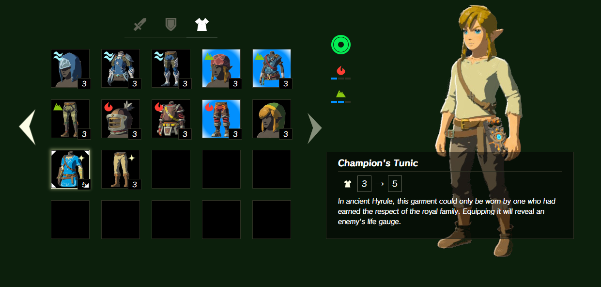

# Zelda BoTW UI Web Replica

This is a simple replica of the Zelda BoTW user interface for learning purposes. Made following [Florent Lagrede](https://github.com/Flow11) article series:

- [Part 1](https://dev.to/flagrede/how-to-replicate-the-zelda-botw-interface-with-react-tailwind-and-framer-motion-part-1-298g)
- [Part 2](https://dev.to/flagrede/how-to-replicate-the-zelda-botw-interface-with-react-tailwind-and-framer-motion-part-2-3nd4)
- [Part 3](https://dev.to/flagrede/how-to-replicate-the-zelda-botw-interface-with-react-tailwind-and-framer-motion-part-3-3949)

## Final result

http://botw-ui-web-replica.s3-website-eu-west-1.amazonaws.com/

## Stack

- Typescript
- React
- Redux
- Tailwind
- Framer-motion

## Credits

- [Florent Lagrede's Game UI on Web](https://www.gameuionweb.com/)
- Items Data: [Zelda Gamepedia](https://zelda.gamepedia.com/Main_Page)
- Font: [Reddit user /75thTrombone](https://www.reddit.com/user/75thTrombone/)
